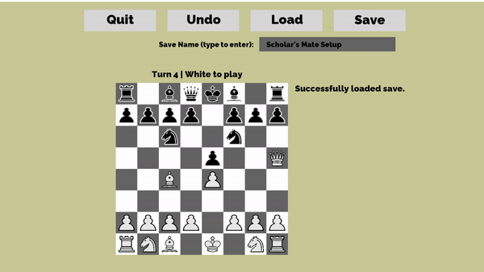
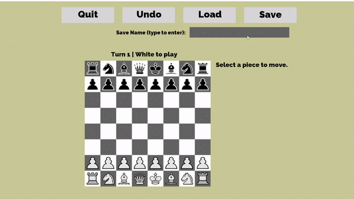
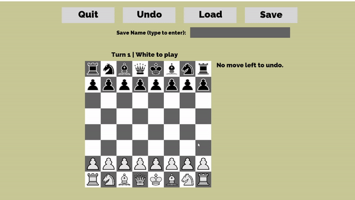
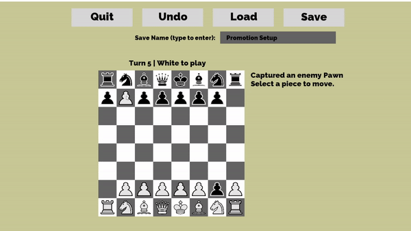

# Chess	
This is a complete recreation of the classic game of Chess made in C++. This chess model faithfully recreates every feature of chess, including:

- Castling
- Checking and illegal King moves
- Checkmate and stalemate
- Pinning
- Pawn promotion
- En Passant

This version also includes a move history and game state saving/loading.

# How to Play
Each move is played by first inputting the tile of the piece you want to move. Then, input the tile that you want that piece to go to.

All pieces and pawns follow the standard chess rules for piece and pawn movement.

You can do various other actions while in a game.
- UNDO - undo the last turn
- SAVE - save the current game to file
- QUIT - exit to main menu.

A game can be loaded at any time on the board. Simply type the name of the save file, then click the button. By default, save files are located in chessplusplus/Saves.

There are various saved games already prepared to show off some chess moves that require setup. 

Scholar's Mate:

Castling:

En Passant:

Pawn Promotion:

Stalemate:

# Future Goals
In the future, look into creating a chess engine that can power a basic AI opponent.