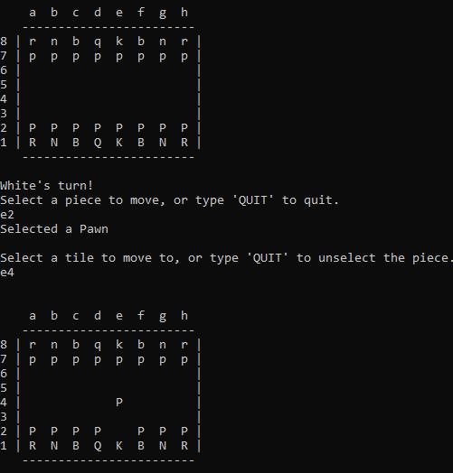
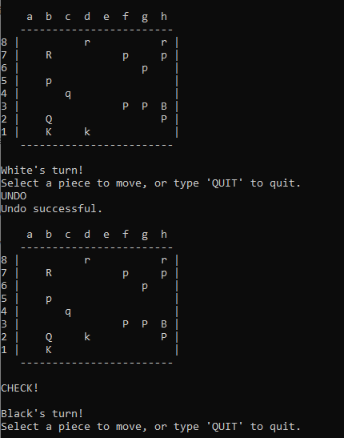
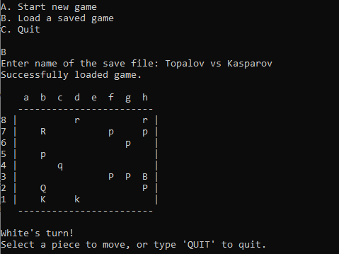
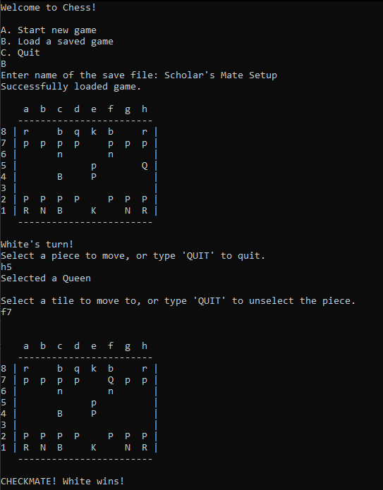
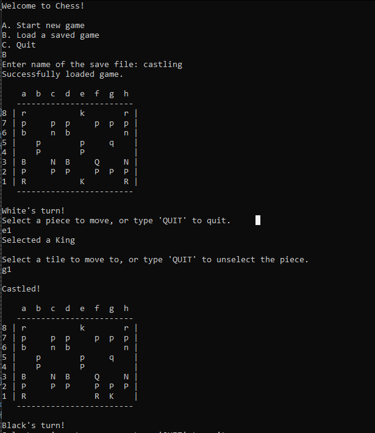
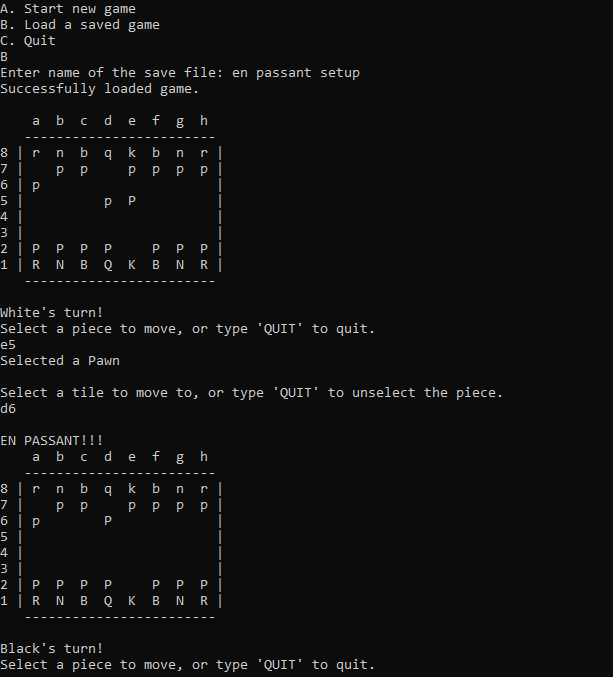
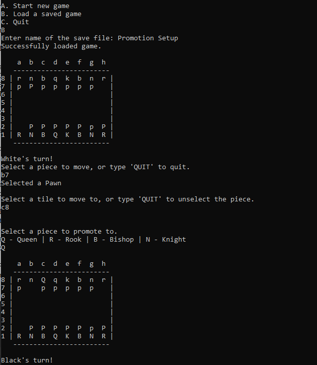

# Chess	
This is a complete recreation of the classic game of Chess made in C++. This chess model faithfully recreates every feature of chess, including:

- Castling
- Checking and illegal King moves
- Checkmate and stalemate
- Pinning
- Pawn promotion
- En Passant

This version also includes a move history and game state saving/loading.

Note: Since this game is in the terminal, White and Black pieces are denoted by capital and lowercase letters, respectively.

Q - Queen | N - Knight | B - Bishop | R - Rook | P - Pawn | K - King

# How to Play
Each move is played by first inputting the tile of the piece you want to move. Then, input the tile that you want that piece to go to.

All pieces and pawns follow the standard chess rules for piece and pawn movement.

You can also enter various other commands while in a game.
- UNDO - undo the last turn
- SAVE - save the current game to file
- QUIT - exit to main menu.

A game can be loaded from the main menu. Simply type the name of the save file when prompted. By default, save files are located in chessplusplus/Saves.

There are various saved games already prepared to show off some chess moves that require setup. 

Scholar's Mate:

Castling:

En Passant:

Pawn Promotion:

# Future Goals
In the future, I want to add a GUI to the project via SFML or similar graphics library.
I also want to look into creating a chess engine that can power a basic AI chess opponent.